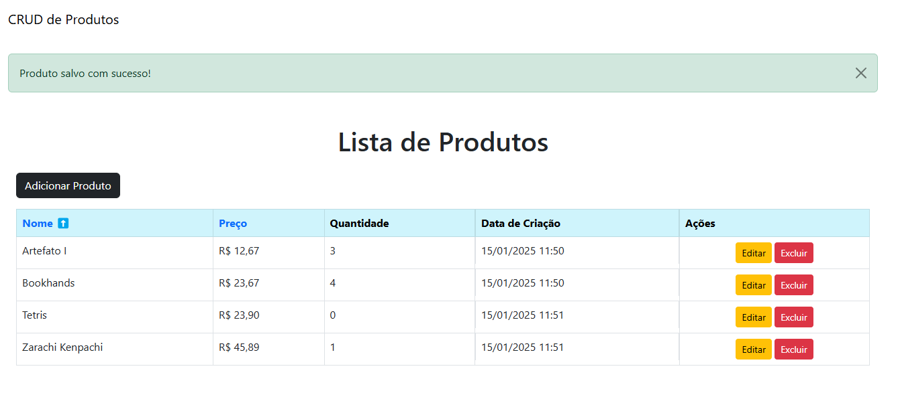

# CRUD de Produtos com Django

Este é um projeto simples de CRUD (Create, Read, Update, Delete) desenvolvido com Django, onde é possível gerenciar produtos com campos como nome, preço e quantidade em estoque. O projeto utiliza validações no modelo e feedback para melhorar a experiência do usuário.




 


## Funcionalidades

- Listar produtos cadastrados.
- Adicionar novos produtos.
- Editar produtos existentes.
- Excluir produtos.
- Ordenação por nome e preço.
- Feedback de sucesso ao salvar, editar ou excluir produtos.

## Tecnologias Utilizadas

- **Python 3.10+**
- **Django 3.2+**
- **Bootstrap 5 (para estilização da interface)**
- **SQLite (banco de dados padrão do Django)**

## Configuração do Projeto

1. Clone o repositório:
   ```bash
   git clone https://github.com/acadl-dev/projeto_produto.git  

2. Crie e ative um ambiente virtual:
   ```bash
   python3 -m venv venv
   source venv/bin/activate  # No Windows, use: venv\Scripts\activate

3. Instale as dependências:
   ```bash
   pip install -r requirements.txt

4.  Aplicar as Migrações
    Configure o banco de dados SQLite e aplique as migrações:
    ```bash
    python manage.py migrate


5. Executar o Servidor
    Inicie o servidor de desenvolvimento:
   ```bash
   python manage.py runserver

6. Acesse o projeto no navegador pelo endereço:
   ```bash
    http://127.0.0.1:8000/produtos/

### Estrutura do Projeto
            projeto/
            ├── env/                     # Ambiente virtual (não incluir no controle de versão)
            ├── projeto_produto/         # Pasta principal do projeto Django
            │   ├── produtos/
            │   │   ├── migrations/          # Arquivos de migração do banco de dados
            │   │   ├── templates/           # Templates HTML para o frontend
            │   │   │   └── produtos/
            │   │   │       ├── base.html    # Layout base
            │   │   │       ├── produto_list.html  # Listagem de produtos
            │   │   │       ├── produto_form.html  # Formulário de criação/edição
            │   │   │       └── produto_confirm_delete.html  # Confirmação de exclusão
            │   │   ├── tests.py             # Testes unitários
            │   │   ├── urls.py              # Rotas do app
            │   │   ├── views.py             # Lógica de controle das views
            │   │   ├── models.py            # Modelo do produto
            │   │   ├── admin.py             # Configurações para o admin do Django
            │   │   └── forms.py             # Formulários do app
            │   ├── manage.py                # Ponto de entrada do Django
            │   ├── db.sqlite3               # Banco de dados SQLite (gerado automaticamente)
            │   └── projeto_produto/
            │       ├── settings.py          # Configurações do projeto
            │       ├── urls.py              # Rotas principais
            │       ├── wsgi.py              # Configuração para servidores WSGI
            │       └── asgi.py              # Configuração para servidores ASGI
            ├── requirements.txt         # Lista de dependências do projeto
            └── .gitignore               # Arquivo para ignorar arquivos/pastas no controle de versão


## Documentação das Rotas
### Rotas no App produto
As rotas abaixo estão definidas no arquivo produto/urls.py. Elas lidam com as operações de CRUD para o gerenciamento de produtos.

<table border="1" style="border-collapse: collapse; width: 100%;">
    <thead>
        <tr>
            <th>Rota</th>
            <th>View</th>
            <th>Descrição</th>
            <th>Método HTTP</th>
        </tr>
    </thead>
    <tbody>
        <tr>
            <td>/</td>
            <td>lista_produtos</td>
            <td>Exibe uma lista de produtos cadastrados.</td>
            <td>GET</td>
        </tr>
        <tr>
            <td>/novo/</td>
            <td>produto_criar</td>
            <td>Exibe um formulário para criar um novo produto e salva os dados enviados.</td>
            <td>GET, POST</td>
        </tr>
        <tr>
            <td>&lt;int:id&gt;/editar/</td>
            <td>produto_editar</td>
            <td>Exibe um formulário para editar um produto existente identificado pelo ID.</td>
            <td>GET, POST</td>
        </tr>
        <tr>
            <td>&lt;int:id&gt;/deletar/</td>
            <td>produto_deletar</td>
            <td>Exibe uma página de confirmação e deleta o produto identificado pelo ID.</td>
            <td>GET, POST</td>
        </tr>
    </tbody>
</table>

### Rotas no Arquivo Principal
As rotas principais estão definidas em urls.py no diretório do projeto. Elas incluem as rotas de administração(não utilizadas) e integram as rotas do app produto.

<table border="1" style="border-collapse: collapse; width: 100%;">
    <thead>
        <tr>
            <th>Rota Base</th>
            <th>Descrição</th>
        </tr>
    </thead>
    <tbody>
        <tr>
            <td>/admin/</td>
            <td>Acesso ao painel administrativo do Django.</td>
        </tr>
        <tr>
            <td>/produto/</td>
            <td>Inclui todas as rotas definidas em <code>produto/urls.py</code>.</td>
        </tr>
    </tbody>
</table>

## Testes

O projeto inclui testes unitários para garantir que as validações e comportamentos do modelo e das views estejam funcionando corretamente. Para rodar os testes:

1. Certifique-se de que o ambiente virtual está ativado.

2. Execute o comando:
    ```bash
    python manage.py test

## Cobertura dos Testes

Os testes foram implementados no arquivo tests.py e cobrem os seguintes cenários:

### Modelo Produto

#### test_criar_produto_valido:
    Verifica se um produto com valores válidos é criado corretamente.

#### test_preco_negativo:
    Testa se o modelo rejeita preços negativos.

#### test_quantidade_negativa:
    Testa se o modelo rejeita quantidades negativas.

### Views de Produto

#### test_criar_produto_via_view:
    Testa a criação de um produto por meio da view e garante que o redirecionamento ocorre após a criação.

#### test_criar_produto_invalido_via_view:
    Verifica se a view rejeita produtos com dados inválidos (nome vazio, preço negativo, quantidade negativa) e exibe mensagens de erro apropriadas.

### Exemplo de Saída Esperada

    Após rodar os testes com sucesso, você verá algo como:

        Creating test database for alias 'default'...
        .....
        ----------------------------------------------------------------------
        Ran 5 tests in 0.025s

        OK
        Destroying test database for alias 'default'...

    

           

    
## Contribuindo

Contribuições são bem-vindas! Se você deseja ajudar a melhorar o projeto, siga estas etapas:

### Passo a Passo para Contribuir

1. **Faça um Fork do Repositório**

   No canto superior direito da página do repositório, clique em **Fork**. Isso criará uma cópia do repositório na sua conta do GitHub.

2. **Clone o Repositório Forkado**

   Clone o repositório forkado para o seu computador local. No terminal, execute:
   ```bash
   git clone https://github.com/acadl-dev/projeto_produto.git  
   
3. Crie uma Nova Branch
   ```bash
   cd projeto_produto
   git checkout -b feature/nova-funcionalidade
   
4. Faça suas Alterações
  Realize as alterações desejadas no código. Você pode adicionar novas funcionalidades, corrigir bugs...
   
5. Faça o Commit das suas Alterações
   Após fazer as alterações, adicione os arquivos modificados ao seu commit:
   ```bash
   git add .
   
6. Envie suas Alterações para o Repositório Remoto
   ```bash
   git commit -m 'Adicionei uma nova funcionalidade'

7. Abra um Pull Request
     Vá para a página do seu repositório forkado no GitHub. Você verá um botão Compare & pull request. Clique nele. Adicione uma descrição das suas alterações e clique em Create pull request.
   

